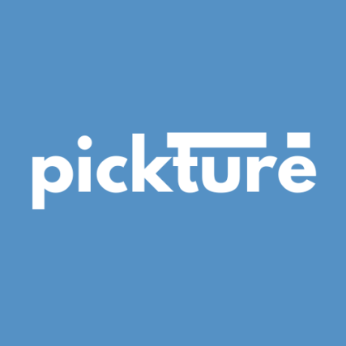
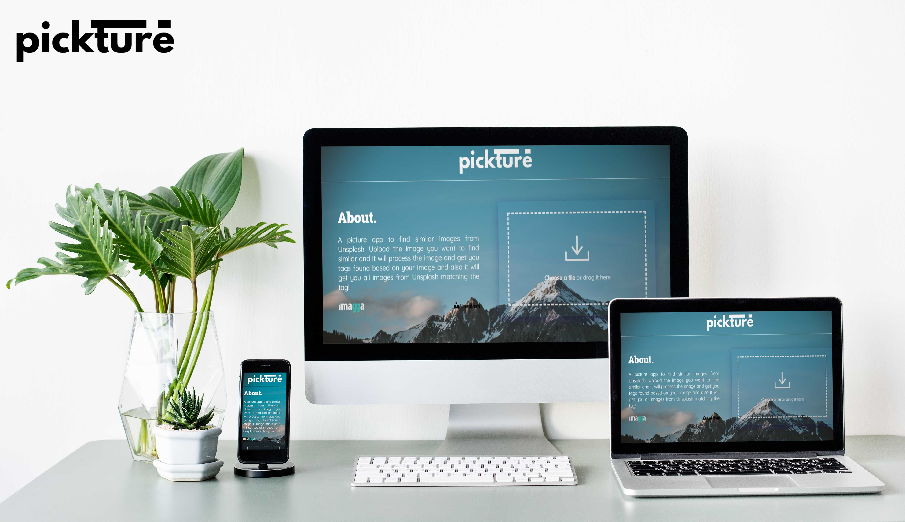

<!--
*** Thanks for checking out the Best-README-Template. If you have a suggestion
*** that would make this better, please fork the repo and create a pull request
*** or simply open an issue with the tag "enhancement".
*** Thanks again! Now go create something AMAZING! :D

***
***
***
*** To avoid retyping too much info. Do a search and replace for the following:
*** github_username, repo_name, twitter_handle, email, project_title, project_description
-->

<!-- PROJECT SHIELDS -->
<!--
*** I'm using markdown "reference style" links for readability.
*** Reference links are enclosed in brackets [ ] instead of parentheses ( ).
*** See the bottom of this document for the declaration of the reference variables
*** for contributors-url, forks-url, etc. This is an optional, concise syntax you may use.
*** https://www.markdownguide.org/basic-syntax/#reference-style-links
-->

[![Contributors][contributors-shield]][contributors-url]
[![Forks][forks-shield]][forks-url]
[![Stargazers][stars-shield]][stars-url]
[![Issues][issues-shield]][issues-url]
[![MIT License][license-shield]][license-url]
[![LinkedIn][linkedin-shield]][linkedin-url]

<!-- PROJECT LOGO -->
<br />

<p align="center" style="background: skyblue">
  <a href="https://github.com/kowalskidev/api-project/">
    
  </a>

  <h3 align="center">pickture</h3>

  <p align="center">
    Hello, World! Pickture let's you upload any image and find images similar to it on Unsplash. Pickture also gets you tags related to that image. You can then view images using the tags too!
    <br />
    <a href="https://github.com/kowalskidev/api-project"><strong>Explore the docs »</strong></a>
    <br />
    <br />
    <a href="https://pickture.herokuapp.com/">View Demo</a>
    ·
    <a href="https://github.com/kowalskidev/api-project/issues">Report Bug</a>
    ·
    <a href="https://github.com/kowalskidev/api-project/issues">Request Feature</a>
  </p>

</p>

<!-- TABLE OF CONTENTS -->

<details open="open">
  <summary><h2 style="display: inline-block">Table of Contents</h2></summary>
  <ol>
    <li>
      <a href="#about-the-project">About The Project</a>
      <ul>
        <li><a href="#built-with">Built With</a></li>
      </ul>
    </li>
    <li>
      <a href="#getting-started">Getting Started</a>
      <ul>
        <li><a href="#prerequisites">Prerequisites</a></li>
        <li><a href="#installation">Installation</a></li>
      </ul>
    </li>
    <li><a href="#usage">Usage</a></li>
    <li><a href="#roadmap">Roadmap</a></li>
    <li><a href="#contributing">Contributing</a></li>
    <li><a href="#license">License</a></li>
    <li><a href="#contact">Contact</a></li>
    <li><a href="#acknowledgements">Acknowledgements</a></li>
  </ol>
</details>

<!-- ABOUT THE PROJECT -->

## About The Project

Hello, World! Pickture let's you upload any image and find images similar to it on Unsplash. Pickture also gets you tags related to that image. You can then view images using the tags too!

### Built With

-   
    <br />

-   

<br />

-   [express.js](https://expressjs.com/)

<br />

<!-- GETTING STARTED -->

## Getting Started

To get a local copy up and running follow these simple steps.

### Prerequisites

-   npm
    ```sh
    npm install npm@latest -g
    ```

*   API Keys
    -   _Get imagga API key from here: [Image Recognition API, Computer Vision AI – Imagga](https://imagga.com/)_
    -   _Get Unsplash API key from here: [Unsplash Image API | Free HD Photo API](https://unsplash.com/developers)_

### Installation

1. Clone the repo
    ```sh
    git clone https://github.com/kowalskidev/api-project.git
    ```
2. Install NPM packages

    ```sh
    npm install
    ```

3. Configure `.env` file (remove .sample extension first!)

    ```markdown
    Imagga_API_Key=
    Imagga_API_Secret=
    Unsplash_API_Key=
    Unsplash_API_Secret=
    ```

<!-- USAGE EXAMPLES -->

## Usage

Open `http://localhost:3000` in your browser and upload the image, Click on `GET SIMILAR IMAGES` button to find the similar images based on the tags detected from your uploaded image.

<!-- ROADMAP -->

## Roadmap

See the [open issues](https://github.com/github_username/repo_name/issues) for a list of proposed features (and known issues).

<!-- CONTRIBUTING -->

## Contributing

Contributions are what make the open source community such an amazing place to be learn, inspire, and create. Any contributions you make are **greatly appreciated**.

1. Fork the Project
2. Create your Feature Branch (`git checkout -b feature/AmazingFeature`)
3. Commit your Changes (`git commit -m 'Add some AmazingFeature'`)
4. Push to the Branch (`git push origin feature/AmazingFeature`)
5. Open a Pull Request

<!-- LICENSE -->

## License

Distributed under the MIT License. See `LICENSE` for more information.

<!-- CONTACT -->

## Contact

Zaid Kesarani - zkesarani@gmail.com

Project Link: [kowalskidev/api-project: Connecting Two APIs together! (github.com)](https://github.com/kowalskidev/api-project)

<!-- ACKNOWLEDGEMENTS -->

## Acknowledgements

-   [othneildrew/Best-README-Template: An awesome README template to jumpstart your projects! (github.com)](https://github.com/othneildrew/Best-README-Template)

<!-- MARKDOWN LINKS & IMAGES -->
<!-- https://www.markdownguide.org/basic-syntax/#reference-style-links -->

[contributors-shield]: https://img.shields.io/github/contributors/kowalskidev/api-project.svg?style=for-the-badge
[contributors-url]: https://github.com/kowalskidev/api-project/graphs/contributors
[forks-shield]: https://img.shields.io/github/forks/kowalskidev/api-project.svg?style=for-the-badge
[forks-url]: https://github.com/kowalskidev/api-project/network/members
[stars-shield]: https://img.shields.io/github/stars/kowalskidev/api-project.svg?style=for-the-badge
[stars-url]: https://github.com/kowalskidev/api-project/stargazers
[issues-shield]: https://img.shields.io/github/issues/kowalskidev/api-project.svg?style=for-the-badge
[issues-url]: https://github.com/kowalskidev/api-project/issues
[license-shield]: https://img.shields.io/github/license/kowalskidev/api-project.svg?style=for-the-badge
[license-url]: https://github.com/kowalskidev/api-project/blob/main/LICENSE
[linkedin-shield]: https://img.shields.io/badge/-LinkedIn-black.svg?style=for-the-badge&logo=linkedin&colorB=555
[linkedin-url]: https://www.linkedin.com/in/zaid-kesarani-119524115/
